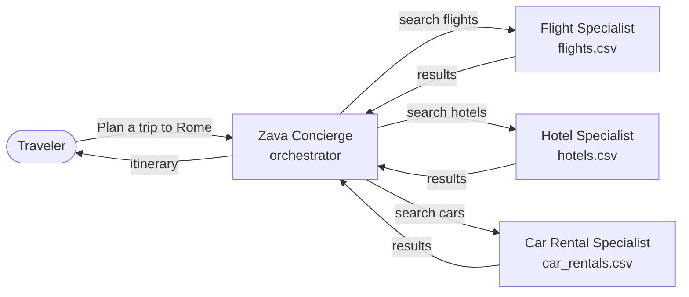

# [Microsoft Build 2026](https://build.microsoft.com)

## LAB540: Observe. Optimize and Protect Your Hosted Agents in Microsoft Foundry

### Session Description

Modern agents can fail in ways that traditional monitoring can't catch. In this hands-on lab, learn more about how Microsoft Foundry Observability helps you move from prototype to production - with context-specific evaluation suites (auto-generated evaluators + test datasets) wired into developer workflows via skills and MCP tooling for hosted agents. Scale quality with continuous evaluations, trace-linked analysis and adaptive red teaming - and walk away with a sandbox you can use to explore additional features at your own pace.

### Business Scenario

Zava Travel is a fictitious premium travel agency specializing in international travel experiences. The team has built the Zava Travel Concierge — an AI-powered multi-agent system that orchestrates specialist agents for flights, hotels, and car rentals to plan complete itineraries. The Concierge does *not* answer questions from its own knowledge — it delegates to these specialist sub-agents, each of which owns one CSV data source and exposes typed Python tools to query it. This is a new agent (with no pre-existing test datasets) and the team needs to ensure that agent responses are reliable, safe and high-quality even as demand scales and requirements change.

### Learning Objectives

In this hands-on lab, we'll see how the Microsoft Foundry Observability platform works with GitHub Copilot and Foundry skills, to simplify the developer experience and accelerate their progress from plan to prototype.

By completing this lab you will learn to:

1. Create and deploy a hosted agent using Azure Developer CLI
1. Auto-generate test datasets and evaluators using the `observe` skill
1. Activate the evaluate-optimize loop to iteratively improve agent
1. Retrieve and analyze production insights to troubleshoot failures
1. Explore new features like adaptive evaluations & optimization service

> 📝 **A note on outcomes.** Every learner walks through the **same workflow**
> and the **same skills** — but the specific scores, evaluator
> recommendations, and optimized prompts you see will **differ from
> other learners and from run to run**. Agent responses are
> non-deterministic, sample sizes are small (n ≈ 10), and the prompt
> optimizer generates a fresh hypothesis each pass. Focus on learning
> the loop and how to interpret what you see — not on matching anyone
> else's numbers.

### 🏫 Getting started

To complete this lab you must have:

1. An Azure subscription
1. A GitHub account (with a GitHub Copilot subscription)
1. Familiarity with Python, VS Code & Agentic AI lifecycles

_An Azure subscription and GitHub Copilot subscription are provided to
in-venue attendees. Self-guided learners should bring their own._

There are **two paths** through this lab — pick the one that matches how you're taking it. These paths use the Copilot-driven learner experience.

| Path | For | Start Here |
|------|-----|------------|
| 🏫 **Skillable** (in-venue) | Build attendees — Azure RG and Foundry agent are pre-provisioned for you | [Skillable Guide](./workshop/docs/00-setup/GUIDE.md#11-skillable-learner-in-venue)) |
| 🏠 **Self-Guided** (at-home) | You'll provision everything yourself with `azd up` | [`Self-Guided`](./workshop/docs/00-setup/self-guided/README.md#self-guided-path-at-home) |

For a manual workshop experience (following instructions step by step) 

> 📋 **Prefer Manual setup?** — see the [Workshop guide](./workshop/docs/README.md). **Given the pace of changes, we recommend using the Copilot guide so you can get the added assistance of inline troubleshooting**

---

 

### 💬 Keep Learning with Copilot

Try these prompts with GitHub Copilot to explore the topics from this session. Open Copilot Chat in VS Code (`Ctrl+Alt+I` on Windows/Linux, `Cmd+Shift+I` on Mac), paste a prompt, and see what you learn. Try connecting the [Microsoft Learn MCP Server](#-microsoft-learn-mcp-server) for the latest official documentation.

Use these as a starting point — or write your own!

| Prompt | What you'll learn |
|:-------|:------------------|
| *"What are Microsoft Foundry Hosted Agents, and when should I use them instead of prompt-based agents?"* | Hosted agents as containerized, framework-agnostic agent code on managed infrastructure — with per-session sandboxes, dedicated Entra identity, and a choice of Responses or Invocations protocols. |
| *"What is Microsoft Foundry Observability, and how do evaluation, monitoring, and tracing work together?"* | The three pillars of Foundry Observability — built-in evaluators (quality, safety, agent-specific), OpenTelemetry tracing via Application Insights, and real-time production monitoring dashboards. |
| *"Walk me through the agent development lifecycle in Microsoft Foundry — from prototype to production."* | The end-to-end loop: build → trace → evaluate → optimize → deploy with `azd` → monitor in production → re-evaluate against real traces to drive the next iteration. |
| *"How do Foundry skills work with GitHub Copilot to help me build and operate agents?"* | How skills package domain knowledge and tool calls so Copilot can invoke Foundry capabilities (generate datasets, run evaluators, inspect traces) directly from VS Code chat. |
| *"My agent is underperforming in production — walk me through the evaluate-optimize loop to fix it."* | How to cluster trace failures, curate a dataset from real traces, re-run evaluators against a new agent version, and validate improvement before shifting traffic. |

### 💻 Technologies Used

1. **[Microsoft Foundry Hosted Agents](https://learn.microsoft.com/azure/foundry/agents/concepts/hosted-agents)** — Run your own containerized agent code (Python or C#, any framework) on Microsoft-managed infrastructure. The platform handles per-session VM-isolated sandboxes, scale-to-zero with stateful resume, dedicated Microsoft Entra agent identity, OpenAI-compatible Responses and custom Invocations protocols, versioned deployments with traffic splitting, and access to Foundry-managed tools via the Toolbox MCP endpoint.
1. **[Microsoft Foundry Observability](https://learn.microsoft.com/azure/foundry/concepts/observability)** — End-to-end evaluation, monitoring, and tracing for agentic AI. Use built-in and custom evaluators (quality, safety, agent-specific metrics like tool call accuracy and task completion), distributed OpenTelemetry tracing wired to Application Insights, real-time production dashboards, and [cloud-based trace evaluation](https://learn.microsoft.com/azure/foundry/how-to/develop/cloud-evaluation#trace-evaluation) to score real production traffic without replay.
1. **[GitHub Copilot for Azure](https://learn.microsoft.com/azure/developer/github-copilot-azure/get-started)** — A VS Code extension that brings Azure context into Copilot Chat. Query live Azure resources, generate infrastructure code, deploy apps with [agent mode](https://learn.microsoft.com/azure/developer/github-copilot-azure/quickstart-deploy-app-agent-mode), and troubleshoot — powered by the Azure MCP Server for tool-calling against Azure services and Azure Resource Graph.
1. **[Azure Developer CLI (`azd`)](https://learn.microsoft.com/azure/developer/azure-developer-cli/overview)** — Open-source CLI that accelerates provisioning and deploying app resources on Azure using template-based workflows. In this lab, `azd up` provisions Foundry resources (project, model deployment, Application Insights, Azure Container Registry) and deploys the hosted agent container image. Extended via [`azd ext install azure.ai.agents`](https://learn.microsoft.com/azure/foundry/agents/how-to/manage-hosted-agent) for hosted agent lifecycle commands.

### 📚 Resources and Next Steps

| Resource | Description |
|:---------|:------------|
| [https://aka.ms/build26-next-steps](https://aka.ms/build26-next-steps) | Take the next step in your learning journey after Build 2026 |

Find other developers, like you, building on Microsoft Foundry in Discord 

### 🌟 Microsoft Learn MCP Server

The Microsoft Learn MCP Server is a remote MCP Server that enables clients like GitHub Copilot and other AI agents to bring trusted and up-to-date information directly from Microsoft's official documentation. Get started by using the one-click button above for VSCode or access the [mcp.json](.vscode/mcp.json) file included in this repo.

For more information, setup instructions for other dev clients, and to post comments and questions, visit our Learn MCP Server GitHub repo at [https://github.com/MicrosoftDocs/MCP](https://github.com/MicrosoftDocs/MCP). Find other MCP Servers to connect your agent to at [https://mcp.azure.com](https://mcp.azure.com).

*Note: When you use the Learn MCP Server, you agree with [Microsoft Learn](https://learn.microsoft.com/en-us/legal/termsofuse) and [Microsoft API Terms](https://learn.microsoft.com/en-us/legal/microsoft-apis/terms-of-use) of Use.*

## Content Owners

<!-- TODO: Add yourself as a content owner
1. Change the src in the image tag to {your github url}.png
2. Change INSERT NAME HERE to your name
3. Change the github url in the final href to your url. -->

<table>
<tr>
    <td align="center"><a href="http://github.com/nitya">
         
        <b>NITYA NARASIMHAN</b></a> 
            <a href="https://linkedin.com/in/nityan" title="talk">📢</a>
    </td>
    <td align="center"><a href="http://github.com/fubaduba">
         
        <b>FILISHA SHAH</b></a> 
            <a href="https://github.com/fubaduba" title="talk">📢</a>
    </td>
</tr>
</table>

## Contributing

This project welcomes contributions and suggestions.  Most contributions require you to agree to a
Contributor License Agreement (CLA) declaring that you have the right to, and actually do, grant us
the rights to use your contribution. For details, visit [Contributor License Agreements](https://cla.opensource.microsoft.com).

When you submit a pull request, a CLA bot will automatically determine whether you need to provide
a CLA and decorate the PR appropriately (e.g., status check, comment). Simply follow the instructions
provided by the bot. You will only need to do this once across all repos using our CLA.

This project has adopted the [Microsoft Open Source Code of Conduct](https://opensource.microsoft.com/codeofconduct/).
For more information see the [Code of Conduct FAQ](https://opensource.microsoft.com/codeofconduct/faq/) or
contact [opencode@microsoft.com](mailto:opencode@microsoft.com) with any additional questions or comments.

## Trademarks

This project may contain trademarks or logos for projects, products, or services. Authorized use of Microsoft
trademarks or logos is subject to and must follow
[Microsoft's Trademark & Brand Guidelines](https://www.microsoft.com/legal/intellectualproperty/trademarks/usage/general).
Use of Microsoft trademarks or logos in modified versions of this project must not cause confusion or imply Microsoft sponsorship.
Any use of third-party trademarks or logos are subject to those third-party's policies.
