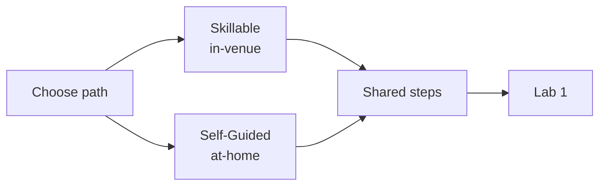

# Setup — Prerequisites & Environment

Before starting the labs, get your environment ready. This workshop has
**two paths** that converge at the end of setup.

By the end of setup, regardless of path, you'll have:

- ✅ A running Codespace (or local VS Code workspace)
- ✅ A populated `.env` file at the repo root
- ✅ The Zava Travel Concierge hosted agent deployed and reachable
- ✅ Three browser tabs open: Foundry portal, Codespace/VS Code, Azure portal

## Choose Your Path

| Path | For | Start Here |
|------|-----|------------|
| 🏫 **Skillable** (in-venue) | Build attendees with a pre-provisioned Azure resource group | [skillable/](./skillable/README.md) |
| 🏠 **Self-Guided** (at-home) | Learners with their own Azure subscription | [self-guided/](./self-guided/README.md) |

After completing your path-specific steps, both paths converge in
[shared/](./shared/README.md).

## Prerequisites Quick Reference

| Requirement | Skillable | Self-Guided |
|-------------|-----------|-------------|
| Azure subscription | ✅ Provided | 🔧 Bring your own (Contributor role) |
| GitHub account + Copilot | ✅ Provided | 🔧 Bring your own |
| VS Code | ✅ Pre-configured in Codespace | 🔧 Local install or Codespace |
| Azure CLI (`az`) | ✅ Pre-installed | 🔧 [Install](https://learn.microsoft.com/cli/azure/install-azure-cli) |
| Azure Developer CLI (`azd`) ≥ 1.25 | ✅ Pre-installed | 🔧 [Install](https://learn.microsoft.com/azure/developer/azure-developer-cli/install-azd) |
| Docker | ✅ Pre-installed | 🔧 [Install](https://docs.docker.com/get-docker/) |
| Python 3.10+ | ✅ Pre-installed | 🔧 [Install](https://python.org) |

## Familiarity Expected

- Basic Python (reading/editing scripts)
- VS Code (terminal, extensions, Copilot Chat)
- Agentic AI concepts (agents, tools, orchestration)
- Azure basics (resource groups, deployments)

## Quick Setup with Copilot

If you have the workshop skills installed, you can ask Copilot:

> "Set up my environment for the workshop"

This invokes the [`setup-env`](../../../.agents/skills/setup-env/SKILL.md)
skill which automates the path detection, Azure login, `.env` creation, and
validation for you.
