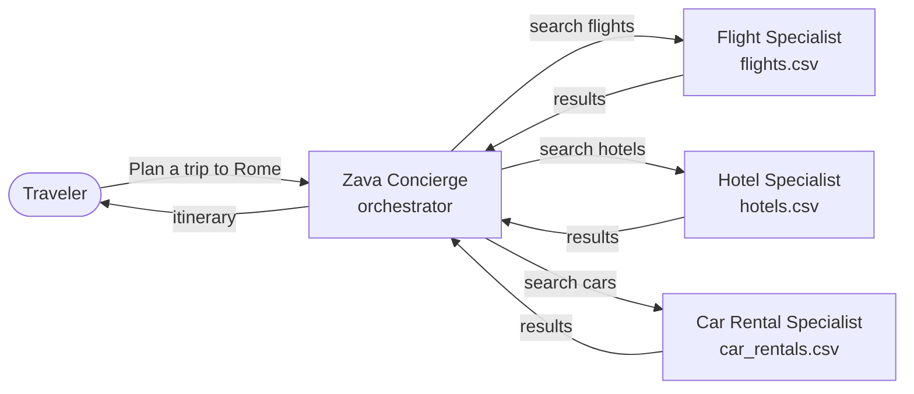

# Zava Travel Concierge — Hosted Agent

This folder contains the **Zava Travel Concierge**, a multi-agent travel
planner deployed to **[Microsoft Foundry Agent Service][foundry-hosted-agents]**
as a containerized hosted agent.

It is the *target application* for [LAB540](../README.md) — the agent you
observe, evaluate, and optimize during the workshop.

> **Two ways to use this folder**
>
> 1. **Just deploy it** — `azd up` from inside `zava/` provisions the
>    Azure resources, builds the container, pushes it, and publishes the
>    agent to Foundry in one command. This is what the workshop self-guided
>    path uses.
> 2. **Read the code** — use it as a reference for how to wire a
>    multi-agent system into the Foundry hosting runtime with the
>    [Microsoft Agent Framework][agent-framework] in Python.

---

## 1. What the agent does

Zava Travel is a fictitious premium travel agency. Its **Concierge** is
the single AI assistant a traveler talks to. The Concierge does *not*
answer questions from its own knowledge — it delegates to three
specialist sub-agents, each of which owns one CSV data source and
exposes typed Python tools to query it.



Supported cities: **Paris, London, Tokyo, Rome, Cancún**.

The Concierge is shipped with **intentionally minimal** instructions
(~12 lines in `main.py`). A much richer rulebook lives in
[`src/zava-travel-concierge/data/zava-travel-instructions.md`](src/zava-travel-concierge/data/zava-travel-instructions.md).
This gap is the workshop's *teaching moment* — the Foundry `observe`
skill detects the resulting failure clusters and the `prompt_optimize`
skill suggests fixes you apply in Lab 3.

---

## 2. Folder layout

```
zava/
├── azure.yaml                      # azd project config (service + infra + deploy)
├── infra/                          # Bicep — Foundry account, project, ACR, App Insights
│   ├── main.bicep                  # subscription-scoped entry point
│   ├── main.parameters.json        # ${ENV_VAR} bindings
│   └── core/                       # ai/, host/, monitor/, search/, storage/
└── src/
    └── zava-travel-concierge/      # the agent itself (this is what gets containerized)
        ├── agent.yaml              # ContainerAgent spec — runtime config
        ├── agent.manifest.yaml     # Agent template manifest — model & resource deps
        ├── Dockerfile              # python:3.12-slim + main.py
        ├── main.py                 # multi-agent code (concierge + 3 specialists)
        ├── requirements.txt        # agent-framework, agent-framework-foundry-hosting
        ├── data/                   # CSVs the specialists query (flights, hotels, cars)
        └── .foundry/               # workshop seed — datasets & evaluators
```

The `azd` runtime cares about three top-level files:

| File | Purpose |
|------|---------|
| [`azure.yaml`](azure.yaml) | Declares the `zava-concierge` service, its `azure.ai.agent` host type, the model deployment to provision (`gpt-4.1-mini`), and the Bicep entry point. |
| [`src/zava-travel-concierge/agent.yaml`](src/zava-travel-concierge/agent.yaml) | The **ContainerAgent** spec — protocol (Responses 1.0), container resources, env vars injected at runtime. |
| [`src/zava-travel-concierge/agent.manifest.yaml`](src/zava-travel-concierge/agent.manifest.yaml) | Declares the **resources** the agent depends on (model deployment), driving the `azd` pre-provision hook. |

---

## 3. Code walkthrough

All the agent code lives in a single
[`src/zava-travel-concierge/main.py`](src/zava-travel-concierge/main.py).
It has four parts.

### 3.1 Data loaders

Three CSVs (`flights.csv`, `hotels.csv`, `car_rentals.csv`) are loaded
once at import time into in-memory lists. No database, no I/O on the hot
path — keeps cold-start fast and behavior deterministic for
evaluation.

### 3.2 Tools

Each specialist's data source is wrapped in one `@tool`-decorated
function — `search_flights`, `search_hotels`, `search_car_rentals` —
with typed parameters via `pydantic.Field` so the model gets a clean
JSON schema. `approval_mode="never_require"` lets the agent call them
without a human-approval round-trip.

### 3.3 The specialist sub-agents

```python
flight_agent = Agent(
    client=_make_client(),
    name="flight_agent",
    instructions="You are the Zava Flight Specialist. ...",
    tools=[search_flights],
)
```

Each specialist is a normal Agent Framework `Agent` with its own
instructions and a single tool. The Concierge then converts them to
**callable tools** via `agent.as_tool(...)`. This is the
[multi-agent orchestration pattern][agent-framework-multi-agent] —
sub-agents *are* tools to their parent.

### 3.4 The hosted runtime

```python
from agent_framework_foundry_hosting import ResponsesHostServer

def main() -> None:
    server = ResponsesHostServer(_build_concierge())
    server.run()
```

`ResponsesHostServer` exposes the Concierge over the OpenAI-compatible
**Responses protocol** on port 8088. That's what the Foundry hosting
infrastructure invokes — and what `azd ai agent invoke` calls when you
test the agent.

### 3.5 Environment variables

When deployed, the Foundry runtime injects three variables into the
container:

| Variable | Source |
|----------|--------|
| `FOUNDRY_PROJECT_ENDPOINT` | Hosting runtime |
| `AZURE_AI_MODEL_DEPLOYMENT_NAME` | `agent.yaml` `environment_variables` |
| `APPLICATIONINSIGHTS_CONNECTION_STRING` | Hosting runtime (if monitoring is on) |

For local runs (`azd ai agent run` or plain `python main.py`), the same
values come from your `.env`. `main.py` accepts either
`FOUNDRY_PROJECT_ENDPOINT` (the runtime name) or
`AZURE_AI_PROJECT_ENDPOINT` (the Bicep output / `.env` name).

---

## 4. Deploy it

> **Prereqs**: Azure subscription, `az`, `azd` ≥ 1.25, Docker, Python
> 3.10+. Run `az login` and `azd auth login` once before you start.

### 4.1 Provision + build + deploy in one shot

From inside this folder:

```bash
cd zava
azd up
```

That single command:

1. Prompts for an environment name + region the first time it runs. **Pick
   one of three supported regions** (see *Supported regions* below).
2. Runs the pre-provision hook to read `agent.manifest.yaml` and
   populate `AI_PROJECT_DEPLOYMENTS`, `AI_PROJECT_DEPENDENT_RESOURCES`
3. Deploys the Bicep — creates a resource group, Foundry account, project,
   model deployment, ACR, Log Analytics + App Insights
4. Builds the container image (remote build inside ACR — no local Docker
   needed thanks to `docker.remoteBuild: true` in `azure.yaml`)
5. Pushes the image to ACR
6. Publishes the agent to Foundry as `zava-concierge`

When it finishes, the output prints the Foundry project endpoint, the
agent application name, and a direct link to the playground. That's
Lab 1 of the workshop done.

### 4.2 Test the deployed agent

```bash
azd ai agent invoke '{"input": "I want to fly from Chicago to Rome next week"}'
```

Or open the **Foundry portal playground** at the link `azd up` printed
and chat with it interactively.

### 4.3 Tear it down

```bash
azd down --purge --force
```

### 4.4 Supported regions

The Bicep is locked to three regions — all of them are in the
[Foundry Hosted Agents preview region list][hosted-agents-regions] **and**
have broad `gpt-4.1-mini` Global Standard quota:

| Region | Role | Notes |
|--------|------|-------|
| **`eastus2`** | **Default ⭐** | Primary US region. Broadest tool support (the only US region with Computer Use). First in Microsoft's hosted-agent region docs. |
| `swedencentral` | EU alternate | Best choice for European learners; gpt-4.1-mini in both Global Standard and Provisioned Managed. |
| `northcentralus` | US backup | Use if eastus2 quota is exhausted. Same tool support as eastus2 except no Computer Use. |

If `azd up` prompts you for a location and you're not sure, pick
**`eastus2`**.

[hosted-agents-regions]: https://learn.microsoft.com/azure/foundry/agents/concepts/hosted-agents#region-availability

---

## 5. Run it locally (no Azure deploy)

For tight inner-loop changes you can run the agent against an existing
Foundry project without redeploying every time. You still need a Foundry
project + a `gpt-4.1-mini` deployment in Azure — but `main.py` runs
locally on your machine.

```bash
cd zava/src/zava-travel-concierge
pip install -r requirements.txt

# point at an existing Foundry project (e.g. one provisioned by `azd up` earlier)
export AZURE_AI_PROJECT_ENDPOINT="https://<account>.services.ai.azure.com/api/projects/<project>"
export AZURE_AI_MODEL_DEPLOYMENT_NAME="gpt-4.1-mini"
az login    # DefaultAzureCredential picks this up

python main.py
# server listening on :8088
```

In a second terminal:

```bash
curl -X POST http://localhost:8088/responses \
  -H "Content-Type: application/json" \
  -d '{"input": "Find me a 4-star hotel in Paris under $400 a night"}'
```

Or use the azd extension if you want the same wire protocol the
deployed agent gets:

```bash
azd ai agent run                                # starts the local host
azd ai agent invoke --local '{"input": "..."}'  # in another terminal
```

---

## 6. Build it from scratch

Want to use this as a template for your own multi-agent system? The
shortest path:

1. **Scaffold a new agent project** with the [Azure AI Agents extension][azd-ai-agents]:

   ```bash
   azd ext install azure.ai.agents
   mkdir my-agent && cd my-agent
   azd ai agent init -m path/to/agent.manifest.yaml
   ```

2. **Copy the four files** that make Zava work:
   - [`src/zava-travel-concierge/main.py`](src/zava-travel-concierge/main.py) — replace the tools/instructions with your own
   - [`src/zava-travel-concierge/Dockerfile`](src/zava-travel-concierge/Dockerfile) — unchanged
   - [`src/zava-travel-concierge/requirements.txt`](src/zava-travel-concierge/requirements.txt) — adjust for your deps
   - [`src/zava-travel-concierge/agent.yaml`](src/zava-travel-concierge/agent.yaml) — rename, adjust resources

3. **Deploy** with `azd up`.

The Bicep in [`infra/`](infra/) is generic — it provisions a Foundry
project, model deployment, ACR, and monitoring with no Zava-specific
hardcoding. Reuse as-is.

---

## 7. References

| Topic | Link |
|-------|------|
| Foundry Hosted Agents | <https://learn.microsoft.com/azure/foundry/agents/concepts/hosted-agents> |
| `azd up` quickstart | <https://learn.microsoft.com/azure/foundry/agents/quickstarts/quickstart-hosted-agent> |
| `azd ai agent` extension | <https://learn.microsoft.com/azure/developer/azure-developer-cli/extensions/azure-ai-foundry-extension> |
| Deploy a hosted agent (SDK + REST) | <https://learn.microsoft.com/azure/foundry/agents/how-to/deploy-hosted-agent> |
| Agent Framework (Python) | <https://github.com/microsoft/agent-framework> |

[foundry-hosted-agents]: https://learn.microsoft.com/azure/foundry/agents/concepts/hosted-agents
[agent-framework]: https://github.com/microsoft/agent-framework
[agent-framework-multi-agent]: https://learn.microsoft.com/agent-framework/concepts/multi-agent
[azd-ai-agents]: https://learn.microsoft.com/azure/developer/azure-developer-cli/extensions/azure-ai-foundry-extension
